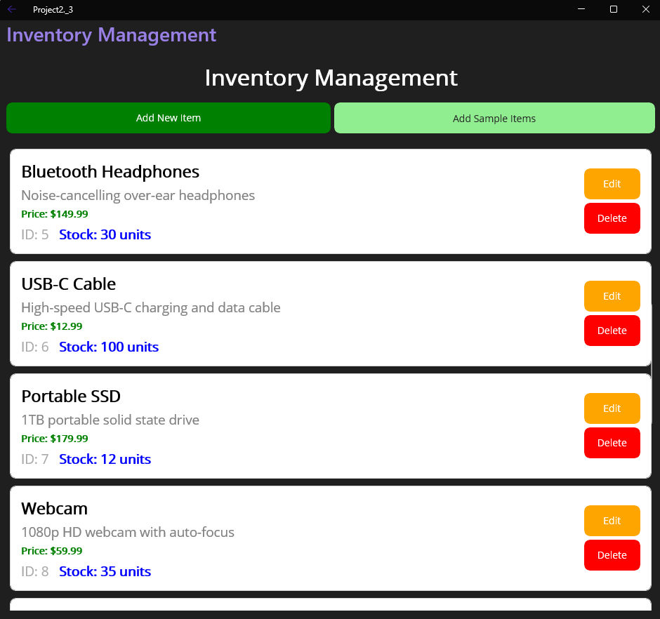

# Inventory Management System

A comprehensive inventory management and shopping application built with .NET MAUI (Multi-platform App UI) targeting Windows, Android, iOS, and macOS platforms.

## Table of Contents

- [Overview](#overview)
- [Features](#features)
- [Screenshots](#screenshots)
- [Prerequisites](#prerequisites)
- [Installation](#installation)
- [Usage](#usage)
- [Project Structure](#project-structure)
- [Technical Details](#technical-details)

## Overview

This Inventory Management System is a modern, cross-platform application that provides businesses with tools to manage their inventory, process customer orders, and maintain accurate stock levels. Built with .NET MAUI, it offers a native experience across multiple platforms while maintaining a single codebase.

## Features

### Inventory Management
- **Complete CRUD Operations**: Create, Read, Update, and Delete inventory items
- **Real-time Stock Tracking**: Monitor stock levels with color-coded status indicators
- **Bulk Data Population**: Quickly populate inventory with sample data for testing
- **Item Details Management**: Track item name, description, price, ID, and quantity
- **Stock Status Indicators**: Visual indicators for In Stock, Low Stock, and Out of Stock items

### Shopping Cart System
- **Interactive Shopping Experience**: Browse available items with detailed information
- **Smart Quantity Management**: Prompted quantity selection with stock validation
- **Cart Management**: Add, view, and manage items in shopping cart
- **Stock Validation**: Prevents overselling by limiting quantities to available stock
- **Real-time Pricing**: Displays individual and total pricing information
- **Checkout Process**: Complete purchase workflow with inventory updates

### User Interface
- **Modern Design**: Clean, intuitive interface with professional styling
- **Responsive Layout**: Adapts to different screen sizes and orientations
- **Color-coded Information**: Visual indicators for different data types and statuses
- **Navigation System**: Tabbed interface for easy access to different sections

### Technical Features
- **Data Binding**: Implements INotifyPropertyChanged for real-time UI updates
- **Cross-platform Compatibility**: Runs on Windows, Android, iOS, and macOS
- **Error Handling**: Comprehensive error handling with user-friendly messages
- **Performance Optimized**: Efficient data structures and UI rendering

## Screenshots

### Main Application Interface

*Welcome screen with navigation options for Inventory Management, Shop, and Quit*

### Inventory Management

*Complete inventory overview with sample items showing:*
- *Item names, descriptions, and pricing*
- *Stock quantities with color-coded status*
- *Edit and Delete buttons for each item*
- *Add New Item and Add Sample Items functionality*

### Shopping Experience

*Browse available items with:*
- *Detailed item information and pricing*
- *Real-time stock quantities*
- *IN STOCK status indicators*
- *Add to Cart functionality with cart management buttons*

---

> **📝 To use these screenshots**: Replace the placeholder files in `docs/images/` with your actual screenshot images using the same filenames. The screenshots show a professional, clean interface with excellent UX design and clear information hierarchy.

## Prerequisites

Before running this application, ensure you have the following installed:

- **.NET 8.0 SDK** or later
- **Visual Studio 2022** (v17.8 or later) with MAUI workload, or **Visual Studio Code** with C# extensions
- **Windows 10/11** (for Windows development)
- **Android SDK** (for Android development)
- **Xcode** (for iOS/macOS development - macOS only)

### MAUI Workload Installation

If you haven't installed the MAUI workload, run:

```bash
dotnet workload install maui
```

## Installation

1. **Clone the repository**:
   ```bash
   git clone <repository-url>
   cd Project2-master/Project2-master
   ```

2. **Restore dependencies**:
   ```bash
   dotnet restore
   ```

3. **Build the project**:
   ```bash
   # For Windows
   dotnet build -f net8.0-windows10.0.19041.0
   
   # For Android
   dotnet build -f net8.0-android
   
   # For iOS
   dotnet build -f net8.0-ios
   ```

4. **Run the application**:
   ```bash
   # For Windows
   dotnet run -f net8.0-windows10.0.19041.0
   
   # Or run the executable directly
   .\bin\Debug\net8.0-windows10.0.19041.0\win10-x64\Project2.3.exe
   ```

## Usage

### Getting Started

1. **Launch the Application**: Start the application using one of the methods above.

2. **Populate Sample Data**: 
   - Navigate to the "Inventory Management" tab
   - Click "Add Sample Items" to populate the inventory with test data
   - This creates 15 sample items with various categories

### Inventory Management

1. **Add New Items**:
   - Click "Add New Item" button
   - Fill in item details (name, description, price, quantity)
   - Confirm to add the item to inventory

2. **Edit Existing Items**:
   - Click "Edit" button next to any item
   - Modify the item details
   - Save changes

3. **Delete Items**:
   - Click "Delete" button next to any item
   - Confirm deletion in the dialog

4. **View Inventory Summary**:
   - Total items and units are displayed at the bottom
   - Stock status is color-coded for quick identification

### Shopping System

1. **Browse Items**:
   - Navigate to the "Shop" tab
   - View all available items with stock information

2. **Add Items to Cart**:
   - Click "Add to Cart" on any item
   - Enter desired quantity when prompted
   - System validates against available stock

3. **Manage Cart**:
   - View cart summary at the bottom
   - Click "View Cart" to see detailed cart contents
   - Proceed to checkout when ready

4. **Complete Purchase**:
   - Review cart items and total
   - Confirm purchase
   - Inventory automatically updates with new stock levels

## Project Structure

```
Project2.3/
├── Platforms/              # Platform-specific code
│   ├── Android/            # Android-specific implementations
│   ├── iOS/                # iOS-specific implementations
│   ├── MacCatalyst/        # macOS-specific implementations
│   ├── Tizen/              # Tizen-specific implementations
│   └── Windows/            # Windows-specific implementations
├── Resources/              # Application resources
│   ├── AppIcon/            # App icons
│   ├── Fonts/              # Custom fonts
│   ├── Images/             # Images and graphics
│   └── Styles/             # XAML styles and themes
├── Pages/                  # Application pages
│   ├── MainPage.xaml       # Main navigation page
│   ├── InventoryManagementPage.xaml  # Inventory management interface
│   ├── ShopPage.xaml       # Shopping interface
│   ├── AddItemPage.xaml    # Add new item form
│   ├── EditItemPage.xaml   # Edit item form
│   └── ViewInventoryPage.xaml  # Simple inventory view
├── Models/                 # Data models
│   ├── Item.cs             # Item model with INotifyPropertyChanged
│   └── CartItem.cs         # Shopping cart item model
├── App.xaml                # Application-level resources
├── AppShell.xaml           # Application shell and navigation
├── MauiProgram.cs          # Application startup configuration
└── Project2.3.csproj      # Project file
```

## Technical Details

### Architecture

- **Framework**: .NET MAUI (.NET 8.0)
- **UI Framework**: XAML with data binding
- **Data Management**: LinkedList for inventory storage, ObservableCollection for UI binding
- **Design Pattern**: MVVM-like pattern with INotifyPropertyChanged implementation

### Key Components

1. **Item Class**:
   - Implements `INotifyPropertyChanged` for real-time UI updates
   - Properties: ItemName, ItemDescription, ItemPrice, ItemId, ItemAmountAvailable
   - Stock status calculation with color-coded indicators

2. **Inventory Management**:
   - Static LinkedList for persistent data storage
   - ObservableCollection for UI data binding
   - Automatic UI refresh on data changes

3. **Shopping Cart**:
   - CartItem class for cart-specific data
   - Stock validation and quantity management
   - Real-time pricing calculations

### Data Binding

The application uses extensive data binding to ensure the UI stays synchronized with the underlying data:

```xml
<Label Text="{Binding ItemName}" TextColor="Black" FontAttributes="Bold" />
<Label Text="{Binding ItemPrice, StringFormat='Price: {0:C}'}" TextColor="Green" />
<Label Text="{Binding StockStatus}" TextColor="{Binding StockStatusColor}" />
```

### Platform Targeting

- **Windows**: Primary development target (Windows 10.0.19041.0)
- **Android**: Cross-platform mobile support
- **iOS**: Apple mobile platform support
- **macOS**: Desktop macOS support via Mac Catalyst

## Contributing

Contributions are welcome! Please follow these steps:

1. Fork the repository
2. Create a feature branch (`git checkout -b feature/amazing-feature`)
3. Commit your changes (`git commit -m 'Add some amazing feature'`)
4. Push to the branch (`git push origin feature/amazing-feature`)
5. Open a Pull Request

### Development Guidelines

- Follow C# coding conventions
- Use meaningful variable and method names
- Add comments for complex logic
- Test on multiple platforms when possible
- Ensure UI responsiveness across different screen sizes

---

**Version**: 1.0  
**Last Updated**: November 2025  
**Compatibility**: .NET 8.0, Windows 10/11, Android 7.0+, iOS 11+, macOS 10.15+
